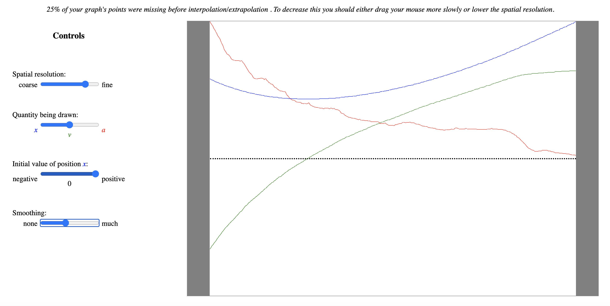

[Heroku deployment](https://graphical-kinematics.herokuapp.com)

This front-end project allows the user to create graphs for [kinematics](https://en.wikipedia.org/wiki/Kinematics), *ie* which involve the position *x*, velocity *v*, and acceleration *a* of a particle which moves in one dimension.
The calculations are done with JavaScript, and the results are rendered with React class components that utilize state. The most basic user-control for this app is the value of the requisite "time-step" (Δ*t*), for which the following pair of considerations must always be balanced:
* Too large will lead to choppy graphs.
* Too small will lead to "noisy" derivatives.

The user creates a graph (of either *x*, *v*, or *a*) by click-and-dragging from left to right across the graphing area, where tall skinny rectangular divs create a horizontal array of targets for the mouse events, each of which involves the mouse entering a div. Vertical mouse-positions may be extracted from the offsetY property of e.nativeEvent.
```
handleEnter = e => {
        e.preventDefault();
        let { state, height } = this;
        let { mousePressed } = state;
        if (!mousePressed) return;
        let id = Number(e.target.id);
        let rawYs =  {...state.rawYs};
        rawYs[id] = e.nativeEvent.offsetY - height / 2;
        let { ys, d1s, d1max, d2s, d2max, i1s, i1max, i2s, i2max } = this.fit(rawYs, id);
        this.setState({ rawYs, ys, d1s, d1max, d2s, d2max, i1s, i1max, i2s, i2max });
}
```
Rather than then calculating a numerical derivative (which is "noisy"), the app uses low-order [polynomial regression](https://en.wikipedia.org/wiki/Polynomial_regression) to fit the function in a small sliding window.  The requisite matrix inversion is done with the npm "matrix-inverse" package.
```
let vector = new Array(M).fill(0);
    let matrix = [];
    for (let i = 0; i < M; i++) {
        matrix.push(new Array(M).fill(0));
    }
    for (const id2 of someIds) {
        for (let i = 0; i < M; i++) {
            vector[i] += rawYs[id2] * id2 ** i;
            for (let j = 0; j < M; j++) {
                matrix[i][j] += id2 ** (i + j);
            }
        }
    }
    const matrixInv = matrixInverse(matrix);
    const vecSol = new Array(M).fill(0);
    for (let i = 0; i < M; i++) {
        for (let j = 0; j < M; j++) {
            vecSol[i] += matrixInv[i][j] * vector[j];
        }
    }
```
The parameters of this polynomial then allow for the noiseless calculation of first- and second derivatives if needed, e.g., to calculate *v* and *a* from *x*.  Having these polynomic parameters available is also handy if/when the user's mouse misses one or more of the div targets, as happens quite frequently with the higher-resolution settings.  In this situation the user data can be interpolated or extrapolated, using the polynomic coefficients.
(However the user is also informed about the gravity of their particular situation, in terms of how may divs get missed.)

Each graph is rendered as a series of connected small slanted line segments, each of which connects two points which are separated horizontally by the timestep &Delta;*t* and which have slightly different *y*-values.  This line segment is the top border of a box whose properties are controlled by css inline-styling.
```
const Bar = ({ j, dt, y, y1, color }) => {
    let t = j * dt;
    let dy = y1 - y;
    let r = Math.sqrt(dt * dt + dy * dy);
    let angle = Math.atan2(dy, dt) * 180 / Math.PI;
    return (
        <div className="segment"
        style={{
            width:`${r}px`,
            left: `${t - r / 2}px`,
            top: `${y}px`,
            transform: `rotate(${angle}deg) translateX(${r / 2}px)`,
            borderColor: `${color}`
        }}
        >
        </div>
    )
}
```
If the user chooses to draw a graph of *v* or *a*, then the determination of the other kinematic quantities requires the calculation of a first- or second-integral, each of which requires user-specification of initial conditions.  I chose to make this app qualitative (rather than quantitative), so I simply allow the user to specify whether the initial values are positive, negative, or zero.
The "smoothing" functionality which is provided to the user involves setting the width of the sliding window that is used for the polynomic regressions: wider windows lead to smoother data.
